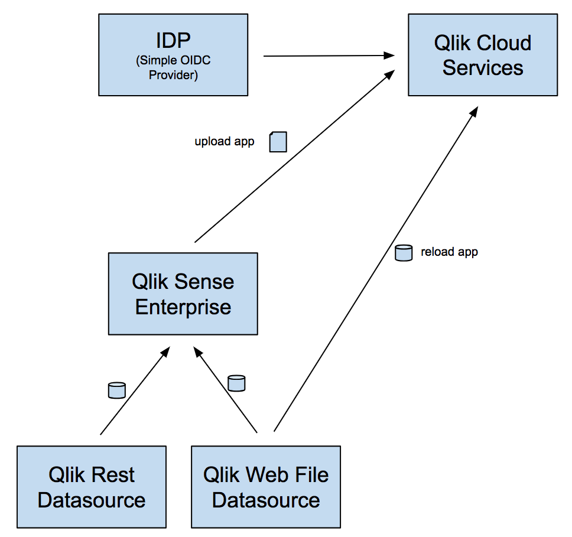
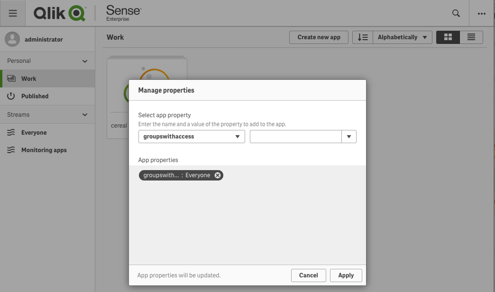

# Editing / Reloading an app using QCS - September Hackathon

This walks through an example of creating, uploading and reloading a Qlik Application using Qlik Cloud Services.

Not all features described in the hackathon project are publicly available yet but I can update with more details as functionality becomes available.

## Steps

#### setup web file datasource and create an app
> Follow the instructions in https://github.com/jimareed/qlik-web-file-datasource to setup your datasource and create your app.

#### install Qlik Sense Enterprise
Install the June or Sept 2018 release of Qlik Sense Enterprise

#### prep the app for QCS

In order to distribute an app to QSEfE, it must contain access control custom properties (e.g., groupswithaccess or userswithaccess) and it must be published.  After publishing the app, go into QMC, select apps and export the app.

#### setup your tenant in QCS
> Follow the instructions in the IdP Configuration section of http://multicloud-recipes.qliktech.com/ to setup your QCS tenant.

#### upload the app using Elastic Distributor
> Follow the instructions in the Tooling section of http://multicloud-recipes.qliktech.com/ to upload the app to QCS.
